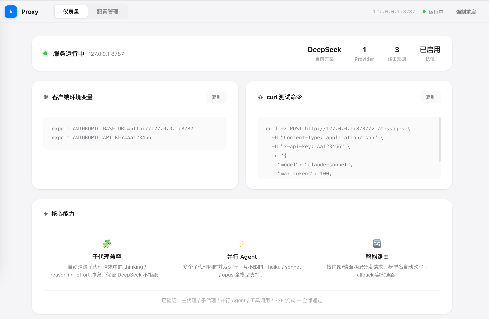

# Claude Code DeepSeek Proxy

一个面向 Claude Code 的 Anthropic 兼容中转服务。把 DeepSeek 等上游接入 Claude Code——按规则匹配路由、按链路自动容灾、透明改写模型名，让 DeepSeek 无缝驱动 Claude Code 的主 agent、子 agent 和并行 agent。

> 🖥️ [Live Demo](https://qipeijun.github.io/claude-code-deepseek-proxy/)

```
┌──────────────┐     ┌──────────────────┐     ┌───────────────────┐
│  Claude Code │────▶│  本代理 :8787    │────▶│ DeepSeek Anthropic │
└──────────────┘     └──────────────────┘     └───────────────────┘
                            │  管理后台 /admin
                            │  - 方案切换
                            │  - 路由配置
                            │  - 实时指标
```

## 为什么需要这个代理

直接用 DeepSeek 接 Claude Code 会遇到两个问题：

1. **子代理请求被拒**。Claude Code 子代理发出的请求同时携带 `thinking: { type: "disabled" }` 和 `reasoning_effort: "medium"`——DeepSeek 严格校验，认为关了思考就不能设 effort，直接返回 400。结果所有子代理和并行 agent 全部不可用。

2. **模型名对不上**。Claude Code 用 `claude-sonnet-4-6` 发过去，上游返回 `deepseek-v4-pro`。如果不在响应中还原模型名，Claude Code 会行为异常。

本代理在 Claude Code 和上游模型之间做：请求规范化 → 路由匹配 → 模型名替换 → 上游转发 → 响应模型名还原 → 失败自动切换。**让 DeepSeek 完整驱动 Claude Code。**

## 快速开始

```bash
# 1. 克隆并安装
git clone https://github.com/qipeijun/claude-code-deepseek-proxy.git
cd claude-code-deepseek-proxy
npm install

# 2. 启动代理
npm start
```

首次启动时没有任何路由规则，代理会提示打开管理后台。终端输出类似：

```
══════════════════════════════════════════════════════
  Claude Code DeepSeek Proxy
  监听地址:  http://127.0.0.1:8787
  管理后台:  http://127.0.0.1:8787/admin
══════════════════════════════════════════════════════
  当前没有任何路由规则，代理无法转发请求。
  请打开管理后台 http://127.0.0.1:8787/admin 完成配置后重启服务。
```

**3. 打开管理后台，三步完成配置：**

打开 `http://127.0.0.1:8787/admin`，点击"创建配置"：

1. **上游连接** — 填写 DeepSeek Anthropic 地址（`https://api.deepseek.com/anthropic`）和 API Key（`sk-xxx`），点击"获取模型列表"验证连通性
2. **模型路由** — 点击快捷按钮添加路由（如 `Claude Sonnet → deepseek-v4-pro`），或自定义精确/前缀匹配规则
3. **高级设置** — 可选：设置本地鉴权密码、配置 fallback 链路、添加额外 Provider

点击"设为当前并保存"，然后重启服务：

```bash
# Ctrl+C 停止，重新启动
npm start
```

**4. 配置 Claude Code 客户端：**

```bash
export ANTHROPIC_BASE_URL="http://127.0.0.1:8787"
# 如果在 admin 中设置了鉴权密码，需要配上：
export ANTHROPIC_API_KEY="你设置的鉴权密码"
```

> **不需要 `.env` 文件。** API Key 和所有配置直接通过管理后台页面填写，持久化保存在 `config-store.json` 中。如果你更希望 Key 通过环境变量注入（避免明文落盘），可以在 admin 中将 API Key 字段留空，改为填写 `apiKeyEnv` 引用环境变量名。

## 核心特性

### 请求体规范化

**子代理和并行 agent 能跑通的关键。** 在请求发出前自动清洗 Claude Code 子代理携带的矛盾字段：

- `thinking.type === "disabled"` 时，删除 `thinking` 和 `reasoning_effort` 字段
- 主代理的扩展思考（`type === "enabled"`）完全不受影响
- 不碰其他字段，最小化干预

### 模型名改写

请求侧将 `body.model` 替换为上游模型名，响应侧（JSON 和 SSE 流）将上游模型名还原为 Claude Code 请求的原始模型名。SSE 流改写做了事件边界缓冲，避免跨 chunk 截断导致的解析错误。

### 模型路由

支持 `exact`（精确匹配）和 `prefix`（前缀匹配）两种规则。`exact` 优先于 `prefix`，多个 `prefix` 同时命中时取最长前缀。无匹配路由时返回 Anthropic 格式的 404 错误。

```yaml
routes:
  - match:
      prefix: claude-sonnet
    provider: deepseek
    upstreamModel: deepseek-v4-pro
    fallback:                          # 可选 fallback 链
      - provider: flash
        upstreamModel: deepseek-v4-pro-flash
```

### Fallback 容灾

只有显式配置了 `fallback` 数组的路由才会在上游失败时切换。触发条件：上游返回 5xx 或 429，或请求本身抛出异常。按 fallback 数组顺序依次尝试，全部失败才返回错误。**不做静默降级、不自动兜底到其他模型。**

### 内容块校验

发出请求前遍历 `system` 和 `messages[].content`，收集所有 `type` 字段，对比 provider 声明的能力集。上游不支持的内容块类型会返回明确错误，**不做字符串拼接或静默丢弃。**

### 连接池管理

按上游 origin 缓存 undici Agent 实例，复用 TCP + TLS 连接。通过槽位机制控制并发上游连接数（默认 32，可通过 `UPSTREAM_MAX_CONNECTIONS` 环境变量调整），池满时返回 503，≥80% 时打警告日志。

### 实时性能指标

内存中维护最近 200 条请求的环形缓冲区，管理后台仪表盘展示：
- 总请求数、活跃连接数、错误数
- 平均延迟、P50/P95/P99 延迟
- 每秒请求数、每秒 Token 数
- 连接池使用率

### 可视化配置管理

启动后打开 `http://127.0.0.1:8787/admin`：



- **配置方案（Profile）**：一组完整的 server/provider/路由配置，可创建多套方案
- **三步配置向导**：上游连接 → 模型路由 → 高级设置
- **一键切换**：激活不同方案后重启服务即生效
- **持久化存储**：所有方案保存在 `config-store.json`（已加入 `.gitignore`）
- **上游模型列表查询**：输入 provider 信息后一键拉取可用模型
- **Provider 连通性测试**：仪表盘上直接测试各 provider 是否可达

配置优先级：`config-store.json` 中的活动方案 > 内置默认配置。

### 认证

支持 `Authorization: Bearer xxx` 和 `x-api-key` 两种方式。在 admin 页面中直接填写鉴权密码（`authToken`），或通过 `authTokenEnv` 引用任意环境变量。不填则不校验。`/healthz` 和管理后台相关路由跳过认证。

## API 端点

| 端点 | 方法 | 说明 |
|------|------|------|
| `/v1/messages` | POST | Anthropic Messages API（支持 SSE 流） |
| `/v1/messages/count_tokens` | POST | Token 计数 |
| `/v1/models` | GET | 列出可用模型 |
| `/healthz` | GET | 健康检查 |
| `/admin` | GET | 管理后台页面 |
| `/api/admin/profiles` | GET | 列出所有配置方案 |
| `/api/admin/profiles` | POST | 创建方案 |
| `/api/admin/profiles/:id` | PUT | 更新方案 |
| `/api/admin/profiles/:id` | DELETE | 删除方案 |
| `/api/admin/profiles/activate` | POST | 激活方案 |
| `/api/admin/upstream-models` | POST | 查询上游可用模型列表 |
| `/api/admin/metrics` | GET | 获取实时性能指标 |
| `/api/admin/kill-port` | POST | 强制释放端口并重启（watch 模式） |

## 通过 New API 网关中转

如果你需要统一管理 API Key、查看用量统计、或对团队做限流控制，可以在前面加一层 [New API](https://github.com/QuantumNous/new-api) 网关：

```
┌──────────────┐     ┌──────────────┐     ┌──────────────┐     ┌───────────────────┐
│  Claude Code │────▶│ 本代理 :8787 │────▶│ New API:3000 │────▶│ DeepSeek Anthropic │
└──────────────┘     └──────────────┘     └──────────────┘     └───────────────────┘
                                              │  管理界面
                                              │  - API Key 管理
                                              │  - 用量统计
                                              │  - 渠道负载均衡
                                              │  - 限流控制
```

**配置步骤：**

1. 启动 New API（`cd ~/new-api-deploy && docker compose up -d`），打开 `http://localhost:3000` 管理界面
2. 在 New API 中添加 DeepSeek 渠道（类型选择 DeepSeek 或自定义 Anthropic 兼容渠道），Base URL 填 `https://api.deepseek.com/anthropic`，模型填 `deepseek-v4-pro`
3. 在 New API 中创建令牌，记下 `sk-xxx`
4. 在本代理的 admin 页面中，将 provider 的 Base URL 改为 `http://127.0.0.1:3000`，API Key 填入 New API 令牌，保存激活即可

| | 直连 DeepSeek | 经 New API 网关 |
|---|---|---|
| **前置条件** | 无 | 需额外部署 New API 服务 |
| **配置方式** | admin 页面填写 DeepSeek 地址 + Key | admin 页面填写 New API 地址 + 令牌 |
| **Key 管理** | Key 直接存储在 config-store.json | New API Web 界面管理，支持多 Key 轮换 |
| **用量统计** | 无（仅本代理内存中的实时指标） | New API Web 界面查看历史用量 |
| **限流/计费** | 无 | New API 支持 |
| **延迟** | 一跳直达 | 多一跳（本地 ~5ms） |
| **适用场景** | 个人开发，追求最低延迟 | 团队共享、需要用量管理和计费控制 |

## 与 ccswitch 并行运行

[ccswitch-deepseek](https://github.com/qipeijun/ccswitch-deepseek) 是另一个中转代理，面向 Codex CLI，做 OpenAI Responses API → DeepSeek Chat Completions 的协议翻译。两者可以同时运行，互不影响：

| | 本项目 | ccswitch |
|---|---|---|
| **目标客户端** | Claude Code | Codex CLI |
| **协议** | Anthropic Messages API | OpenAI Responses API |
| **端口** | 8787 | 11435 |
| **协议层** | 直接转发 | 完整协议翻译 |

```
┌──────────────┐     ┌──────────────┐
│  Claude Code │────▶│ 本代理 :8787 │────▶ DeepSeek Anthropic API
└──────────────┘     └──────────────┘
┌──────────────┐     ┌──────────────┐
│  Codex CLI   │────▶│ ccswitch    │────▶ DeepSeek Chat Completions API
└──────────────┘     │ :11435       │
                     └──────────────┘
```

## 环境变量

代理自身读取的环境变量（硬编码）：

| 变量 | 说明 | 默认值 |
|------|------|--------|
| `NODE_ENV` | 设为 `production` 时输出 JSON 日志 | 开发模式（彩色日志） |
| `LOG_LEVEL` | 日志级别：debug / info / warn / error | `info` |
| `CONFIG_STORE_PATH` | 配置持久化文件路径 | `./config-store.json` |
| `UPSTREAM_MAX_CONNECTIONS` | 上游连接池大小上限 | `32` |

通过 admin 配置引用的环境变量（用户自定义名称，非硬编码）：

- Provider 的 `apiKeyEnv`：在 admin 页面中，API Key 可以直接填写，也可以留空并设置 `apiKeyEnv` 为任意环境变量名，代理启动时会从该环境变量读取。例如设为 `DEEPSEEK_API_KEY`，则需在启动前 `export DEEPSEEK_API_KEY=sk-xxx`。
- Server 的 `authTokenEnv`：同理，鉴权密码可以通过 `authTokenEnv` 引用环境变量。

## 开发

```bash
npm install          # 安装依赖
npm start            # 直接启动（tsx，无需编译）
npm run dev          # 开发模式（tsx watch，文件变更自动重启）
npm run build        # TypeScript 编译到 dist/
npm test             # 运行全部测试（vitest）
npm run test:watch   # 测试 watch 模式
npm run typecheck    # 仅类型检查
```

### 项目结构

```
src/
  index.ts              入口 — 加载配置 → 构建服务器 → 监听端口
  server.ts             Fastify 服务器 — 路由注册、认证、代理+fallback 编排
  router.ts             模型路由匹配 — exact > prefix > 最长 prefix 优先
  config.ts             Provider 解析（环境变量读取 + baseUrl/apiKey 解析）
  http.ts               上游 HTTP 调用 — undici Agent 连接池复用 + 槽位控制
  modelRewrite.ts       模型名改写 — 请求替换 + 响应还原（JSON + SSE 流）
  requestNormalize.ts   请求体规范化 — 清洗子代理的不兼容字段
  contentBlocks.ts      内容块校验 — 发出前拒绝上游不支持的类型
  metrics.ts            请求指标收集 — 内存环形缓冲区，实时延迟/吞吐量
  errors.ts             ProxyError 类 + Anthropic 格式错误响应
  types.ts              Zod schema 定义 + TypeScript 类型
  defaultConfig.ts      内置默认配置（空路由，引导 admin 页面配置）
  admin.ts              Admin API — 方案 CRUD + 上游模型查询 + 指标 + 端口管理
  admin.html            管理后台页面（单文件 HTML，零依赖）
  store.ts              配置持久化 — JSON 文件读写 + 写锁防并发覆盖
  util.ts               工具函数
tests/
  config.test.ts              配置解析测试
  server.test.ts              服务集成测试（app.inject()，不 mock 网络）
  requestNormalize.test.ts    请求体规范化单测
```

### 日志

- 开发环境（`NODE_ENV !== "production"`）使用 `pino-pretty` 输出彩色人类可读日志，级别 `info`
- 生产环境输出 JSON 格式，级别 `info`
- 启动时打印配置概览：监听地址、认证方式、上游 provider 和路由规则

## 设计原则

- 不支持的 Anthropic 内容块返回清晰错误，不做字符串拼接兜底
- 只有显式配置了 `fallback` 的路由才会在上游失败时切换，不自动兜底
- provider 的 `baseUrl` 和 `baseUrlEnv` 互斥，必须且只能配置一个
- `route.match` 的 `exact` 和 `prefix` 互斥，必须且只能配置一个
- 配置持久化不引入额外依赖，直接用 JSON 文件读写

## 技术栈

- **运行时**：Node.js >= 22，ESM
- **框架**：Fastify 5 + `@fastify/cors`
- **HTTP 客户端**：undici 7（Agent 连接池复用 + AbortController 超时）
- **配置校验**：Zod
- **测试**：Vitest（Fastify `app.inject()` 集成测试）
- **日志**：pino（Fastify 内置）

## License

MIT
